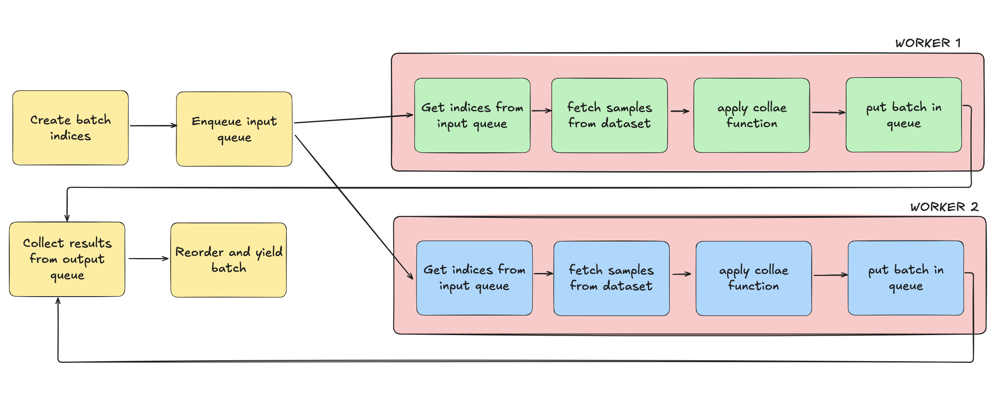

## fromscratch-dataloader

Minimal, readable reimplementation of PyTorch’s DataLoader.

Inspired by projects like `nanoGPT`, this repo strips down PyTorch’s [DataLoader](https://pytorch.org/docs/stable/data.html#torch.utils.data.DataLoader) to its essence.

---

## Why

PyTorch’s DataLoader is powerful but complex (~1600 lines). At its core, it does:

- batching indices
- fetching samples
- collating into tensors
- parallelizing and prefetching

This repo keeps a simple, readable implementation so you can learn, teach, and extend it.

---

## Walkthrough

### 1. Sequential loop

```python
for i in range(len(dataset)):
    yield dataset[i]
```

### 2. Add batching

```python
for i in range(0, len(dataset), batch_size):
    batch = [dataset[j] for j in range(i, i + batch_size)]
    yield collate_fn(batch)
```

### 3. Add workers

Spawn N worker processes:

- Main process: schedules batches, reorders results, yields
- Worker process: fetches dataset samples, collates, returns via queue

### 4. Add prefetch

Keep up to `num_workers × prefetch_factor` batches in flight. This helps avoid dataloader starvation while bounding memory usage.

### 5. Add extras

- `shuffle`: randomize indices
- `drop_last`: drop incomplete batches
- `pin_memory`: faster CPU→GPU transfer
- `persistent_workers`: keep workers alive across epochs

Our `MiniDataLoader` keeps only the essentials.

---

## What’s inside

- `mini_loader.py`: Minimal DataLoader (Python), supports `prefetch_factor`
- `test_compare.py`: Compare against `torch.utils.data.DataLoader` (toy dataset)
- `test_compare_mnist.py`: MNIST benchmark (uses torchvision), limited batches
- `rust/`: Work-in-progress Rust reimplementation

---

## Quickstart

```bash
git clone https://github.com/<you>/fromscratch-dataloader.git
cd fromscratch-dataloader
pip install -r requirements.txt
```

Run a benchmark:

```bash
python test_compare.py
```

Run the MNIST benchmark (downloads MNIST on first run):

```bash
python test_compare_mnist.py
```

Example output:

```
torch.DataLoader (MNIST): 1.90 sec (~100 batches)
MiniDataLoader (MNIST): 1.87 sec (~100 batches)
```

---

## Why MiniDataLoader can look faster in benchmarks

- Less overhead: no support for advanced features like `IterableDataset`, timeouts, error propagation, signal cleanup
- Simpler queues: one in/out queue and minimal bookkeeping
- No pin-memory thread: avoids extra CPU copy (may be slower if training on GPU)
- Prefetch factor: throttles like PyTorch, with fewer checks

On real GPU training, PyTorch’s production DataLoader typically matches or surpasses this once all features are enabled.

---

## 📊 How Workers Work



The magic of `num_workers > 0` is that the main process stops fetching data itself. Instead, it becomes an orchestrator:

1. Main Process
   - Splits the dataset indices into batches.
   - Sends these batch indices into an input queue.
   - Collects processed batches from an output queue.
   - Ensures batches are yielded in the correct order (using a sequence number).
   - Keeps the queue warm with `num_workers × prefetch_factor` in-flight tasks.

2. Worker Processes
   - Each worker runs a simple loop:
     - Take `(seq, batch_indices)` from the input queue.
     - Call `dataset[i]` for each index.
     - Run `collate_fn` on the list of samples.
     - Put `(seq, batch_tensor)` onto the output queue.
   - Repeat until they get a sentinel (`None`) = shutdown signal.

3. Backpressure Control
   - We don’t enqueue all batches at once.
   - At most `num_workers × prefetch_factor` batches are in flight.
   - This prevents memory blowup and keeps workers and main loop in balance.

## Roadmap

- [x] Minimal Python DataLoader
- [x] Add `prefetch_factor` (match PyTorch behavior)
- [ ] Add `shuffle` and `drop_last` options
- [ ] Add pin-memory support
- [ ] Write deeper docs
- [ ] Rust reimplementation
- [ ] Benchmark Python vs Rust
- [ ] Explore async I/O and GPU pinning in Rust

---

## Contributing

This is an educational repo. PRs for docs, examples, and Rust experiments are welcome.
